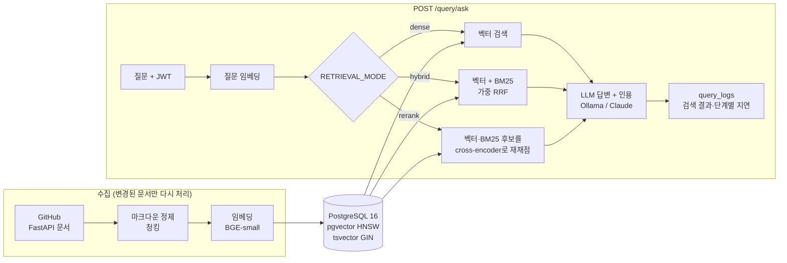

# rag-doc-qa

[](https://github.com/hyeonbin123/rag-doc-qa/actions/workflows/ci.yml)

FastAPI 공식 문서(문서 155개, 청크 915개)에 질문하면 관련 문서를 찾아 **출처가 붙은 답변**을 돌려주는 RAG(검색 증강 생성) API 서버. 검색 방식을 바꿀 때마다 질문셋으로 측정했고, 기본값은 측정 전에 정한 규칙을 통과할 때만 바꿈.

## 한눈에 보기

| 항목 | 내용 |
|---|---|
| 기능 | JWT 로그인 → 질문 → 문서 검색 → 인용이 붙은 답변. 질문마다 검색 결과와 단계별 지연을 로그로 남김 |
| 백엔드 | FastAPI(비동기), SQLAlchemy 2.0 + asyncpg, Alembic, PostgreSQL 16 + pgvector, Docker Compose, GitHub Actions CI |
| AI | 로컬 임베딩 `BAAI/bge-small-en-v1.5`, 로컬 LLM Qwen2.5-7B(Ollama) 또는 Claude API, cross-encoder 재정렬 |
| 검색 모드 | `dense` / `hybrid`(벡터 + SQL로 계산한 BM25, 가중 RRF) / `rerank`(cross-encoder 재채점). 기본값은 `dense` (아래 v7) |
| 평가 | 질문셋 3개(테스트 30, 튜닝용 32, 새 테스트 43문항), Hit@k·MRR·검색 지연, LLM 판정 답변 정확도 |
| 품질 관리 | pytest 29개(통합 테스트는 실제 Postgres + pgvector 사용), push마다 CI에서 ruff + pytest |
| 응답 시간 | 약 4.6초 (대부분 로컬 LLM 생성 시간, RTX 2080 Ti) |

## 구조



## 응답 예시

로컬에서 서버를 띄워 `POST /query/ask`로 실제로 보낸 질문과 응답 (기본값 dense, 로컬 Qwen2.5-7B, 2026-09-12).

**질문**: How do I return a 404 error when the item someone asks for doesn't exist?

**답변** (받은 그대로):

> To return a 404 error when the item someone asks for doesn't exist, you can raise an `HTTPException` with a status code of 404 and an appropriate detail message. For example:
>
> ```python
> from fastapi import HTTPException
>
> @app.get("/items/{item_id}")
> def read_item(item_id: int):
>     item = get_item(item_id)
>     if item is None:
>         raise HTTPException(status_code=404, detail="Item not found")
>     return item
> ```
>
> In this example, if `get_item(item_id)` returns `None`, the `HTTPException` is raised, resulting in a 404 response with the detail "Item not found".

**인용**: `docs/en/docs/tutorial/handling-errors.md` › Handling Errors (코사인 유사도 0.697)

**지연**: 임베딩 33ms, 검색 25ms, 생성 10,252ms. 생성은 답변과 인용 추출을 두 번에 나눠 호출함. 응답 본문에는 이 밖에 `chunk_id`, `document_id`, `query_log_id`가 들어 있어서, 로그 API로 이 요청의 검색 결과 전체를 다시 볼 수 있음.

## 핵심 결과

| 단계 | 한 일 | 결과 |
|---|---|---|
| v1 → v3 | 문서 마크업 노이즈 정제 (헤딩 앵커, include 지시문, HTML) | MRR 0.828 → 0.933 |
| v4 | 하이브리드 검색 (Postgres `ts_rank` + RRF) | 테스트셋 MRR 0.898 < 0.933, 채택 안 함. 원인은 `ts_rank`에 IDF가 없는 것 |
| v5 | BM25를 SQL로 구현, 튜닝용 질문셋 분리 | 튜닝용 셋에선 앞서고 테스트셋에선 뒤짐(0.894). 30문항으로는 차이를 가리기 어렵다고 판단 |
| v6 | cross-encoder 재정렬 (지연 예산 1초 안에서 후보 수 선택) | 실패하던 q017 해결, 답변 정확도 4.73 → 4.87. 그러나 미리 정한 기준(MRR)에서 탈락 |
| v7 | 문서를 보기 전에 쓴 새 테스트셋 43문항, 답변 정확도를 기준으로 재판정 | 재정렬이 Hit@5는 올렸지만(0.88 → 0.93) 답변 정확도는 동점(4.60). 동점이면 빠른 쪽을 남긴다는 규칙에 따라 기본값을 dense로 확정 |

각 단계의 가설, 절차, 문항 단위 분석은 [docs/experiments.md](docs/experiments.md)에, 리포트 원본은 `eval/reports/`에 있음.

## 설계 판단

- **별도 벡터DB 대신 pgvector**: 이 규모에서는 관계형 데이터와 벡터를 한 DB에서 다루는 쪽이 운영 부담이 적음. HNSW는 IVFFlat과 달리 list 수 튜닝이 필요 없음. 전문 검색 컬럼(`tsvector`)도 같은 테이블의 생성 컬럼이라 수집 코드가 따로 신경 쓸 필요가 없음.
- **로컬 모델**: 데모를 비용 없이 반복할 수 있게 임베딩과 LLM을 로컬에서 돌림. BGE 모델은 질문에만 지시문 프리픽스를 붙여야 제 성능이 나오므로, 질문용과 문서용 임베딩 함수를 분리해 호출하는 쪽에서 헷갈릴 수 없게 함.
- **인용을 스키마로 강제**: "인용 형식을 지켜라"라고 부탁하는 대신 JSON 스키마(Claude는 `tool_choice`, Ollama는 제약 디코딩)로 강제함. 로컬 7B 모델은 제약 디코딩 중 문자열 속 따옴표를 이스케이프하지 못해 코드가 든 답변이 잘렸음. 그래서 Ollama 경로만 답변(자유 텍스트)과 인용(숫자 목록)을 두 번에 나눠 호출함.
- **측정 규칙을 먼저 정함**: 파라미터는 튜닝용 질문셋에서만 고르고, 테스트셋에는 고른 설정 하나만 돌림. 기본값을 바꾸는 조건도 측정 전에 정함. v5와 v6에서 결과가 기대와 달라도 규칙을 사후에 바꾸지 않았음.
- **BM25를 SQL로**: 확장이나 통계 테이블 없이 GIN 인덱스로 문서 빈도를, `tsvector` 위치 정보로 단어 빈도를 계산함. 이 규모에서 질의 1회 약 40~50ms라 DB 이미지를 바꾸는 확장(ParadeDB)까지는 필요 없다고 판단함.
- **재정렬의 비용 관리**: cross-encoder는 질문이 올 때마다 후보마다 모델을 돌려야 해서, CPU에서 후보 하나에 60~80ms가 듦. 품질을 재기 전에 검색 지연 예산(중앙값 1초)부터 정하고 그 안에서만 후보 수를 고름. 모델 호출은 스레드에서 실행해 이벤트 루프를 막지 않음.
- **청커 버전을 수집 해시에 포함**: 원문만 해시하면 청킹 로직을 바꿔도 재수집 때 모든 문서가 "변경 없음"으로 건너뛰어져, 예전 청크로 측정하게 되는 잠재 버그가 있었음.

## 알려진 한계

- 두 검색 방식 모두 못 찾는 질문이 있음. "파일 다운로드"를 물으면 dense는 업로드 문서를 가져옴(t010). 사용자와 문서가 다른 용어를 쓰는 경우("필드" vs "쿼리 파라미터", t043)도 둘 다 실패함. 기존 테스트셋의 q017은 `rerank` 모드에서만 풀림.
- 재정렬은 정답 문서를 상위 5개에 더 자주 넣지만, 로컬 7B 생성 모델은 컨텍스트 구성이 조금만 바뀌어도 답이 달라져서 답변 정확도 평균은 그대로였음 (v7).
- 질문셋이 30~43문항이라, 문항 하나가 순위 한 칸 바뀌면 MRR이 0.02 안팎 움직임. 방법 간 작은 차이는 가려내기 어려움.
- 판정은 로컬 7B 모델이 하므로 오판이 있음. 예를 들어 검색 실패 후 "컨텍스트에 정보가 없다"는 올바른 거절 응답을 환각으로 표시한 적이 있음.
- 키워드 커버리지는 거친 지표임. 판정 정확도가 5점인데 핵심 이름을 다르게 표현해 커버리지가 0인 문항이 있어서, 두 지표를 함께 봐야 함.
- Claude API 경로는 코드와 단위 테스트만 있고, 실제 API로는 돌려 보지 않았음(크레딧 없음).

## 로컬 실행

### 사전 준비
- Docker Desktop (WSL2 backend)
- 생성 프로바이더 중 하나:
  - **Ollama**(기본, 무료): [ollama.com](https://ollama.com) 설치 후 `ollama pull qwen2.5:7b-instruct`. VRAM 6GB 이상 GPU 권장.
  - **Anthropic**: `ANTHROPIC_API_KEY` 발급 후 `.env`에 `GENERATION_PROVIDER=anthropic` 설정

### 1. 환경 변수
```bash
cp .env.example .env
# .env를 열어 ANTHROPIC_API_KEY 등을 채운다
```
호스트의 5432 포트를 쓸 수 없으면 `.env`의 `POSTGRES_HOST_PORT`와 `DATABASE_URL`의 포트를 같이 바꾼다(테스트용 `TEST_DATABASE_URL`도 마찬가지). 로컬에 Postgres가 이미 떠 있는 경우도 있지만, Windows에서는 Hyper-V/WSL이 부팅할 때 이 포트를 예약 범위에 넣는 경우도 있다(`netsh interface ipv4 show excludedportrange protocol=tcp`로 확인).

### 2. 전체 스택 실행
```bash
docker compose up --build
```
DB 헬스체크 통과 후 API가 마이그레이션(`alembic upgrade head`)을 자동 적용하고 `http://localhost:8000`에서 뜬다. Swagger UI: `http://localhost:8000/docs`.

`.env`는 호스트에서 실행하는 기준(`localhost`)으로 그대로 두면 된다. compose가 API 컨테이너의 `DATABASE_URL`은 `db` 서비스로, `OLLAMA_BASE_URL`은 `host.docker.internal:11434`(호스트에서 실행 중인 Ollama)로 덮어쓴다. 임베딩 모델과 재정렬 모델(`rerank` 모드용)은 빌드할 때 이미지에 넣어 두므로 실행 중에는 HuggingFace에 접속하지 않는다. torch는 CPU 빌드를 써서 이미지 크기는 약 2.35GB다.

### 3. 문서 수집 (최초 1회)
```bash
docker compose exec api python -m scripts.ingest_fastapi_docs
```
FastAPI 공식 문서(GitHub `tiangolo/fastapi`, `docs/en/docs/**/*.md`)를 가져와 청킹·임베딩 후 DB에 적재한다. 재실행해도 내용이 바뀐 문서만 다시 처리한다(content hash 기반 idempotent). 해시에 청커 버전(`CHUNKER_VERSION`)이 포함되어 있어서, 청킹 로직을 바꾸고 버전을 올리면 전체 문서가 자동으로 다시 처리된다. 컨테이너 안에서는 `uv run` 대신 `python -m`으로 실행한다. `uv run`은 실행할 때마다 dev 의존성까지 설치하려고 하기 때문이다.

### 4. 데모 사용자 생성 및 질문
```bash
docker compose exec api python -m scripts.seed_demo_user demo@example.com password123

curl -X POST localhost:8000/auth/login \
  -d "username=demo@example.com&password=password123"
# 응답의 access_token을 아래에 사용

curl -X POST localhost:8000/query/ask \
  -H "Authorization: Bearer <ACCESS_TOKEN>" \
  -H "Content-Type: application/json" \
  -d '{"question": "How do I declare a path parameter in FastAPI?"}'
```

## 로컬 개발 (Docker 없이 코드만 보는 경우)

```bash
uv sync
uv run alembic upgrade head   # DATABASE_URL이 로컬 Postgres를 가리켜야 함
uv run uvicorn app.main:app --reload
```

## 테스트

```bash
docker compose up -d db
uv run pytest
```
`tests/conftest.py`는 `ragdb_test` 데이터베이스와 스키마에 필요한 확장(`vector`, `pgcrypto`)이 없으면 직접 만들고, 테스트마다 스키마를 생성·정리한다. 임베딩·생성·재정렬 모델은 외부 API를 부르지 않는 결정론적 fake로 대체된다. push와 PR마다 GitHub Actions가 pgvector 서비스 컨테이너를 띄워 같은 ruff + pytest를 실행한다 (`.github/workflows/ci.yml`).

## 평가

```bash
uv run python -m eval.run_retrieval_eval --tag v1_baseline
uv run python -m eval.run_answer_eval --tag v1_baseline
# 판정 LLM 호출 없이 빠르게 반복하려면
uv run python -m eval.run_answer_eval --skip-judge --tag quick
# (청커를 바꿨다면 CHUNKER_VERSION을 올리고 재수집한 뒤)
uv run python -m eval.run_retrieval_eval --tag v2_tuned
# 검색 모드 비교 (--mode를 생략하면 RETRIEVAL_MODE 설정을 따름)
uv run python -m eval.run_retrieval_eval --mode dense --tag v4_dense
uv run python -m eval.run_retrieval_eval --mode hybrid --tag v4_hybrid
# 파라미터 튜닝은 검증셋으로만 한다 (--dataset 기본값은 테스트셋인 eval/qa_dataset.jsonl)
uv run python -m eval.run_retrieval_eval --mode hybrid --dataset eval/qa_dev.jsonl --lexical-weight 0.5 --tag dev_w050
# rerank: 목록당 후보 수 기본값은 검증셋에서 고른 5 (--rerank-pool로 변경). 리포트에 검색 지연 p50/p95도 기록됨
uv run python -m eval.run_retrieval_eval --mode rerank --dataset eval/qa_dev.jsonl --tag dev_rerank
# 두 평가 모두 --dataset으로 질문셋을 고른다 (v7은 eval/qa_test2.jsonl)
uv run python -m eval.run_answer_eval --mode rerank --dataset eval/qa_test2.jsonl --tag v7_rerank
```
결과는 `eval/reports/`에 마크다운으로 남는다. 판정 LLM은 `GENERATION_PROVIDER` 설정을 그대로 따르므로, Ollama 설정이면 평가 전체가 무료로 돌아간다.

## 하지 않은 것 (의도적 스코프 제한)

커스텀 프론트엔드, 멀티테넌트 RBAC, 수평 확장, 백그라운드 잡 큐, 스트리밍 응답, 임의 코퍼스 업로드, 임베딩 파인튜닝, 레이트리밋/캐싱 레이어, 이메일 인증/소셜 로그인. 이유는 각 항목이 "포트폴리오 프로젝트의 핵심 역량 증명"과 무관하거나 3~6주 스코프를 벗어나기 때문.
